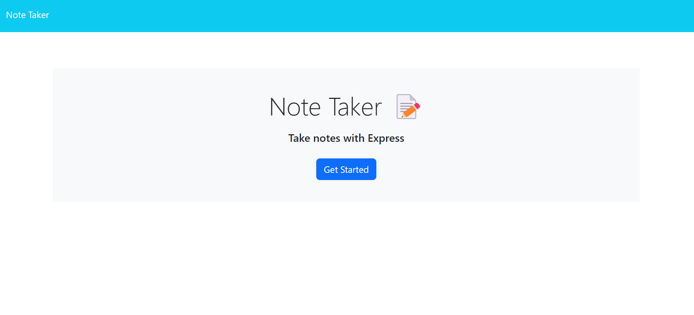
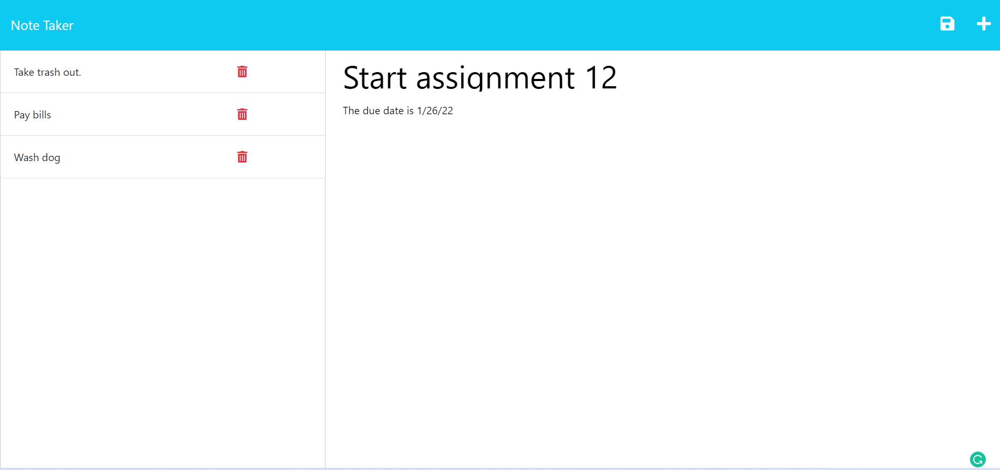

# Note Taker

## Link to deployed site: https://wasmulb-note-taker.herokuapp.com/notes

## Description

For this assignment, I developed the back-end of a note-taker web page. I used express to develop the server. The website allows the user to add notes with a title and text, and save them for later viewing. This assignment was deployed using Heroku. 

I learned a lot about express and back-end development from this assignment. I learned how to effectively develop GET and POST requests. Since the front-end of the assignment was provided, I had to sift through someone else's code, and develop my server based on the code that was provided. This was a great learning experience. 

My biggest obstacle for the assignment was getting all the necessary middleware and imports installed. Initially, I thought I had all the necessary imports and middleware to my server, but I was having errors with my GET request for "/api/notes". After another classmate looked at my code, they pointed out to me that my GET request was set up fine, but I was missing the "path" import. This was something I did not troubleshoot. I now know that double checking imports/middleware can save me a lot of troubleshooting time down the road.

For bonus points, I attempted to add delete functionality. I have not completed this feature at this time.

## Installation

N/A

## Usage

To use my note-taker website, follow the link provided above. The landing page will appear.

All previously saved notes will be on the left side of the page. To add a new note, click "+" in the top-right side of the page. Enter a title in the title field; and text in the text field. Then click the save icon to save. If you want to edit a past note, click the note you wish to edit on the left side. The note then becomes viewable.
 

## License

The MIT License was used for this assignment.

